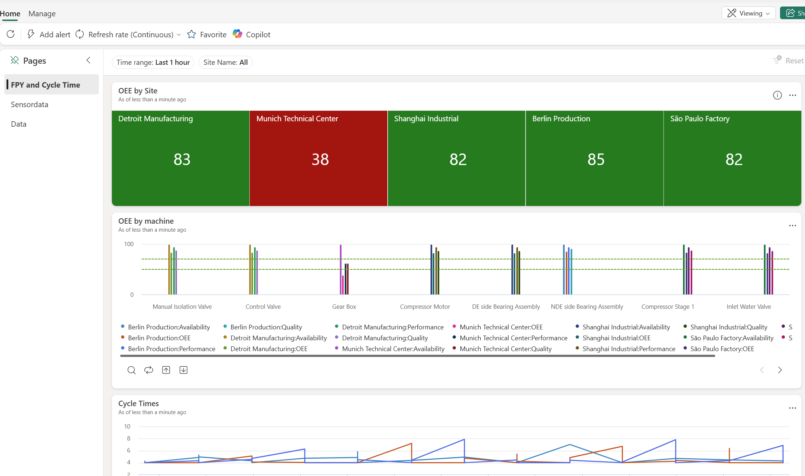
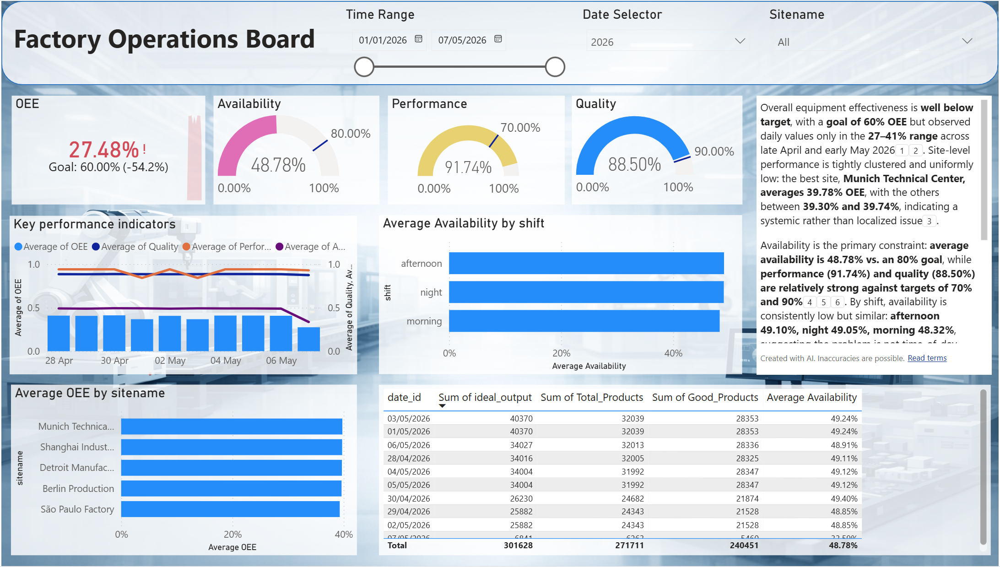
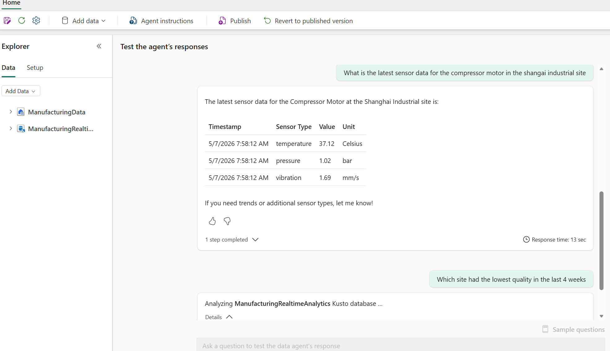

# 🏭 Real-Time Intelligence Manufacturing Demo

End-to-end Microsoft Fabric demo that showcases a modern manufacturing scenario: streaming machine telemetry, ingesting SAP master data, building a Lakehouse + Eventhouse, and surfacing insights through Power BI reports, a real-time KQL dashboard, and an AI Data Agent.

## 🖼️ Architecture



## ✨ What's Inside

- 📡 **Eventstream** — ingests live MQTT machine telemetry into the Eventhouse
- 🔥 **Eventhouse / KQL Database** — stores and queries high-volume sensor data in real time
- 🏞️ **Lakehouse** — holds SAP master data (customers, suppliers, plants, equipment, products) and curated production quality data
- 📓 **Notebooks** — simulate machine data, ingest SAP data, process master data, and run Spark Structured Streaming
- 🪈 **Data Pipeline** — orchestrates the end-to-end flow
- 📊 **Reporting** — Power BI report, Semantic Model, and an MQTT Real-Time Dashboard
- 🤖 **AI Data Agent** — natural-language Q&A over the manufacturing data

## 🚀 Deploy It

Everything in this folder is a Fabric workspace definition you can deploy with [fabric-cicd](https://microsoft.github.io/fabric-cicd/latest/).

1. ⬇️ **Clone (or download) this repository** so you have the demo files locally:

   ```bash
   git clone https://github.com/DaSenf1860/jumpstartdemos.git
   cd jumpstartdemos/rtimanufacturingdemo
   ```

2. 📦 **Install the library:**

   ```bash
   pip install fabric-cicd azure-identity
   ```

3. 🔑 **Sign in with the Azure CLI** (used by the deploy script):

   ```bash
   az login
   ```

4. ⚙️ **Edit `deploy.py`** and set your target `workspace_id`.

5. 🚢 **Run the deployment:**

   ```bash
   python deploy.py
   ```

   This publishes all items (Lakehouse, Eventhouse, Eventstream, Notebooks, Pipeline, Reports, Data Agent) into your Fabric workspace.

6. 📤 **Upload the sample data:** copy everything from the sibling [`rtimanufacturingdemo_data/`](../rtimanufacturingdemo_data) folder into a new subfolder called `data` under the **`ManufacturingData`** Lakehouse's `Files` area (final path: `Files/data/`). You can do this from the Fabric portal (Lakehouse → Files → New subfolder → Upload).

## 🛠️ Post-Deployment Setup

After the items are published, open the **`PostDeploymentNotebook`** in the Fabric workspace and run it. It wires everything together — loading sample data, configuring connections, and getting the demo ready to use.

## 🎉 Have Fun

Once the **`PostDeploymentNotebook`** has been running for 5 minutes, you can already see streaming data visualized in the RealtimeDashboard (Reporting Folder).



You see your core KPIs updating in Realtime, also explore the other pages of this dashboard to drill down on sensor data timeseries and to see the most recent data coming in.

Once the **`PostDeploymentNotebook`** has been running for 10 minutes, you can also go to the Power BI report **`ManufacturingOperationsReport`** and dive deeper on how KPIs have been trending over time, and how they differ by dimensions like sites, time, shifts and machines.



You can also open the **🤖 `TalkToManufacturingData`** Data Agent and ask natural-language questions like *"What is the latest sensor data for the compressor motor in the shangai industrial site?"* or *"Which site had the lowest quality in the last 4 weeks?"*



Feel free to explore the Notebooks, Eventhouse KQL queries, and pipeline to see how all the pieces fit together. 🔍

## 📁 Repository Layout

| Folder | Purpose |
| --- | --- |
| `AI/` | 🤖 Data Agent definition |
| `Develop/` | 📓 Notebooks (simulation, ingestion, streaming, master data) |
| `Eventhouse/` | 🔥 KQL Eventhouse for real-time telemetry |
| `Eventstream/` | 📡 MQTT and machine-data Eventstreams |
| `Lakehouse/` | 🏞️ Manufacturing Lakehouse |
| `Pipeline_orchestration.DataPipeline/` | 🪈 Orchestration pipeline |
| `PostDeploymentNotebook.Notebook/` | 🛠️ One-click setup after deployment |
| `Reporting/` | 📊 Power BI Report, Semantic Model, KQL Dashboard |
| `deploy.py` | 🚢 fabric-cicd deployment script |
| `parameter.yml` | 🎛️ Environment-specific parameter overrides |

## 